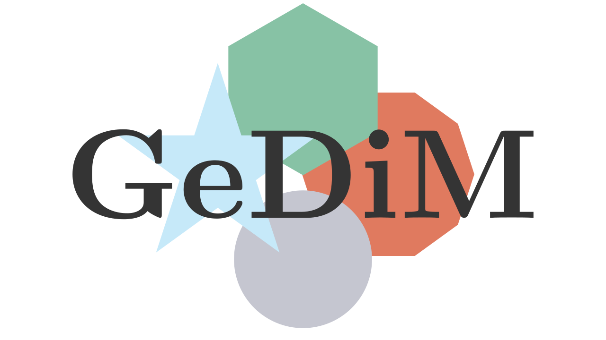

# GeDiM

GeDiM (GEometry for DIscretization MEthod library) is an open-source library based on collaborative development. 
It provides a flexible framework for the common geometrical operations in 1D, 2D, and 3D used in discretization methods for solving linear and nonlinear partial differential equations. 

GeDiM is inspired by and built upon the foundational research of the Numerical Analysis Group in the Department of Mathematical Sciences "Giuseppe Luigi Lagrange" (DISMA) at the Politecnico di Torino.

See the official [documentation](https://polydim.it/).